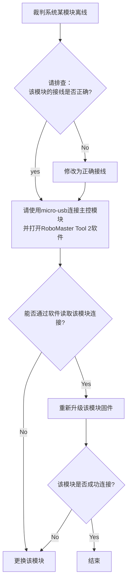

# 1.1 裁判系统模块离线

```mermaid

flowchart TD

  st[裁判系统某模块离线] --> cond1{"请排查："<br>该模块的接线是否正确?}
  
  cond1 -- yes --> op2[请使用micro-usb连接主控模块<br>并打开RoboMaster Tool 2软件]
  cond1 -- No --> op1[修改为正确接线] --> op2
  
  op2 --> cond2{能否通过软件读取该模块连接?}
  
  cond2-- No --> op3[更换该模块]
  cond2 -- Yes --> op4[重新升级该模块固件]
  
  op4 --> cond3{该模块是否成功连接?}
  
  cond3 -- Yes --> e[结束]
  cond3 -- No --> op3
  
```
