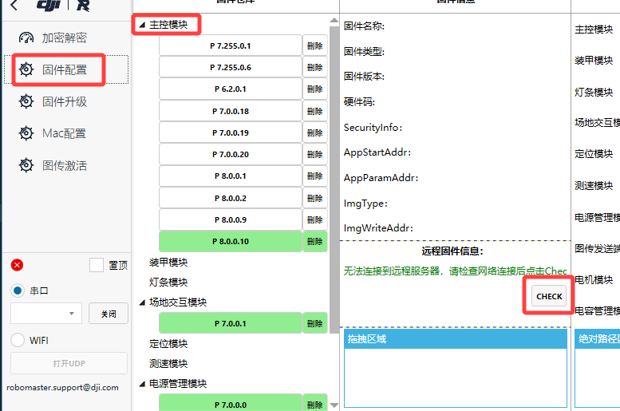
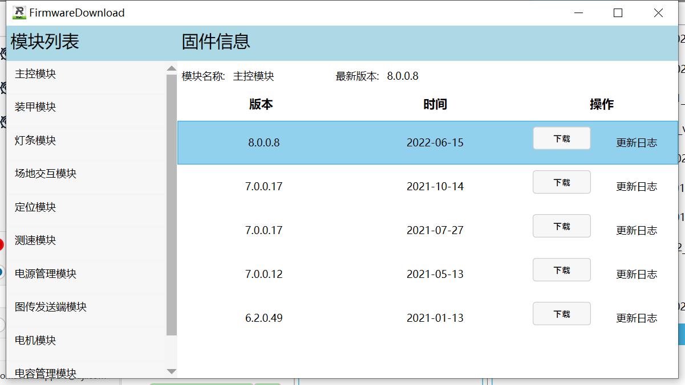
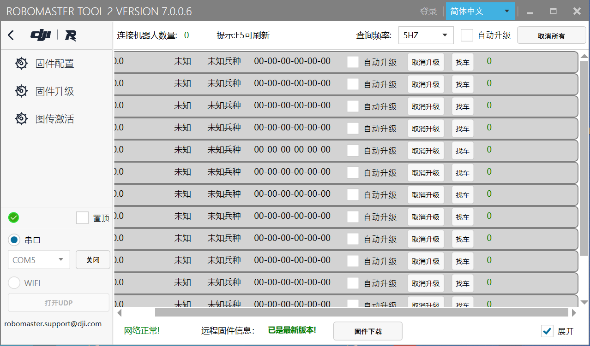

# 1.11 大版本升级

跨版本升级**请先升级至8.0.0.8后再次重新升级至所需版本**。

1.连接主控并打开RMTOOL 2。 
2.点击左侧***固件配置***，再点击***远程固件信息***下方的**check**按钮，查看可用的在线固件。 
  
  
3.点击**下载**8.0.0.8版本固件后，**关掉下载界面**，再打开上图中**固件仓库**中的***主控模块***一列，双击选中**E 8.0.0.8**，并再次升级。 
4.升级过程中主控版本V255.255.255.255读条结束后，会不断刷出“未知兵种”的模块（如下图），请**不要**断开主控的连接，并等待大约3分钟后，不再重复弹出未知模块，此时**给主控断电再重新上电**，重新连接RM TOOL2 后发现成功升级到8.0.0.8。
  
5.此时重新再打开上图中**固件仓库**中的***主控模块***一列，双击选中需要升级的版本（例如P 8.0.0.10）,点击升级等待升级成功。  

*注：升级过程中任意过程失败后都可以断开连接，再将主控重新连接至RM TOOL2， 此时显示版本为255.255.255.255，重新升级一遍8.0.0.8版本固件即可。*
