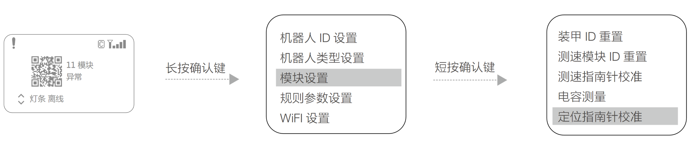

# 1.13未校准
1. 在主控模块的功能页面下，按如下操作，进入定位模块校准设置页面。

2. 在该页面下，选择“定位指南针校准”，则会进入定位模块校准状态。
3. 保持定位模块水平方向（Pitch 轴和 Roll 轴角度小于 10°），在原地沿着定位模块 Yaw 轴旋转
360°。
4. 完成校准后，定位模块的 SYS 灯效为绿灯快闪（2HZ）；若 SYS 灯效为绿灯为慢闪（1HZ）则说明校
准失败。
5. 若校准不成功请重复上述步骤，或者参考最新高校系列赛机器人制作规范手册中的定位模块安装规范，
检查定位模块的安装是否规范。