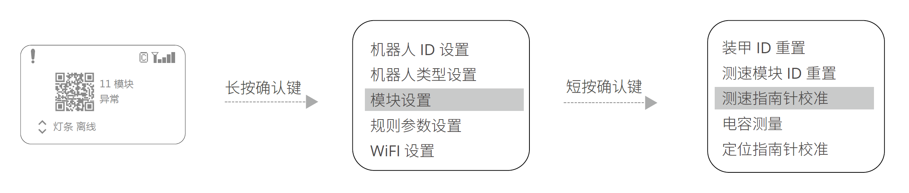

# 1.14未校准

1. 在主控模块的功能页面下，按如下操作，进入测速模块校准设置页面：

2. 在该页面下，选择“测速指南针校准”，则会进入测速模块校准状态，此时测速模块的侧面灯板会亮起一列绿色的灯珠，表示测速模块的水平校准进度条。
3. 保持测速模块枪口朝向水平方向（Pitch 轴和 Roll 轴角度小于 10°），在原地沿着测速模块 Yaw 轴旋
转 360°，测速模块的侧面灯板表示的水平校准进度条会逐渐充满，直至水平校准完成。
4. 完成水平校准后，测速模块的侧面灯板会亮起一列紫色的灯珠，表示测速模块的垂直校准进度条。
5. 保持测速模块枪口朝向为重力正方向或反方向（角度差小于 10°），在原地沿着测速模块 Roll 轴旋转
360°，测速模块的侧面灯板表示的垂直校准进度条会逐渐充满，直至垂直校准完成。
6. 若校准不成功请重复上述步骤，或者参考最新高校系列赛机器人制作规范手册中的测速模块安装规范，
检查测速模块的安装是否规范。