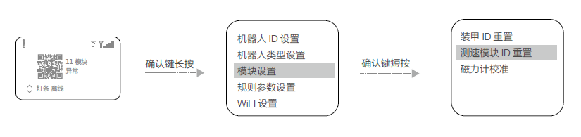

# 1.6 测速模块故障

- **测速模块传感器损坏**  
  1. 请检查测速模块传感器是否有积灰
  2. 请更换测速模块

- **测速模块ID冲突**  
如安装多个测速模块，请重新设置测速模块ID，步骤如下：
  1. 在主控模块的功能页面下，按如下操作，进入测速ID设置页面：
  
  3. 在该页面下，选择“*测速模块ID重置*”，则会进入测速模块ID重置状态，此时测速模块的侧面灯板会以一定频率红蓝双闪。
  4. 按照顺序依次用不透明物体戳进测速模块的枪口，触发测速模块内前端的红外传感器，测速模块的侧面灯板会亮起黄灯，随后熄灭并重启。此时该测速模块ID设置完成。**第一个被触发的17mm测速模块的ID被设置为0**，之后被触发的17mm测速模块随2、4、6......偶数递增。**第一个被触发的42mm测速模块的ID被设置为1**，之后被触发的42mm测速模块随2、4、6......奇数递增。请根据机器人制作规范手册对应章节的要求完成测速模块ID重置。
  5. 完成以上操作后，可以通过查询测速模块的版本号，来确认测速模块的ID设置是否成功。如果读取的有效测速模块数和实际安装的测速模块数量相同，则表示测速模块的ID设置成功。
