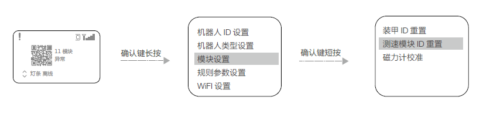

# 1.6 测速模块故障

- **测速模块传感器损坏**  
  1. 请检查测速模块传感器是否有积灰
  2. 请更换测速模块  

- **测速模块ID冲突**  

如安装多个测速模块，请重新设置测速模块ID，步骤如下：
  1. 在主控模块的功能页面下，按如下操作，进入测速ID设置页面：
  
  3. 在该页面下，选择“*测速模块ID重置*”，则会进入测速模块ID重置状态，此时测速模块的侧面灯板会以一定频率红蓝双闪。
  4. 按照顺序依次用不透明物体戳进测速模块的枪口，触发测速模块内前端的红外传感器，测速模块的侧面灯板会亮起黄灯，随后熄灭并重启。此时该测速模块ID设置完成。**第一个被触发的17mm测速模块的ID被设置为0**，之后被触发的17mm测速模块随2、4、6......偶数递增。**第一个被触发的42mm测速模块的ID被设置为1**，之后被触发的42mm测速模块随2、4、6......奇数递增。请根据机器人制作规范手册对应章节的要求完成测速模块ID重置。
  5. 完成以上操作后，可以通过查询测速模块的版本号，来确认测速模块的ID设置是否成功。如果读取的有效测速模块数和实际安装的测速模块数量相同，则表示测速模块的ID设置成功。

- **测速模块未校准**

1. 在主控模块的功能页面下，按如下操作，进入测速模块校准设置页面：

2. 在该页面下，选择“测速指南针校准”，则会进入测速模块校准状态，此时测速模块的侧面灯板会亮起一列绿色的灯珠，表示测速模块的水平校准进度条。
3. 保持测速模块枪口朝向水平方向（Pitch 轴和 Roll 轴角度小于 10°），在原地沿着测速模块 Yaw 轴旋
转 360°，测速模块的侧面灯板表示的水平校准进度条会逐渐充满，直至水平校准完成。
4. 完成水平校准后，测速模块的侧面灯板会亮起一列紫色的灯珠，表示测速模块的垂直校准进度条。
5. 保持测速模块枪口朝向为重力正方向或反方向（角度差小于 10°），在原地沿着测速模块 Roll 轴旋转
360°，测速模块的侧面灯板表示的垂直校准进度条会逐渐充满，直至垂直校准完成。
6. 若校准不成功请重复上述步骤，或者参考最新高校系列赛机器人制作规范手册中的测速模块安装规范，
检查测速模块的安装是否规范。

- **测速模块需要清灰**
1. 使用内窥镜（牙科镜）检查滤光片，若枪管附近存在积灰可以用软毛刷/低压气泵清洁。