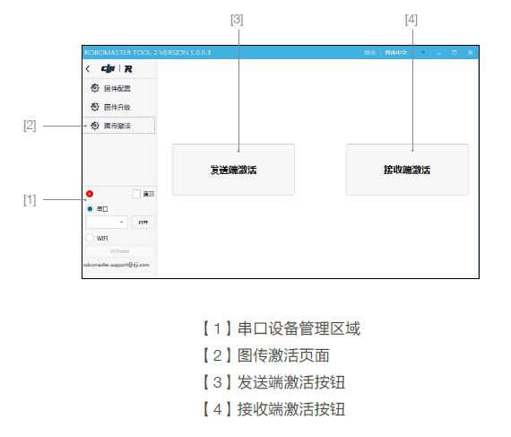
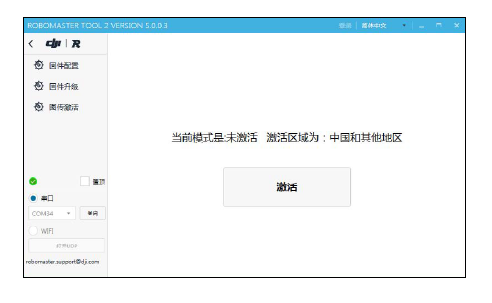

# 1.8 图传模块故障

|  故障类别  |  解决方案  |
|  ---  |  ---  |
|  未启动  |  图传发送端启动需一段时间，若长时间保持该状态请更换图传模块。 |
|  核心板未使能  |  图传发送端启动需一段时间，若长时间保持该状态请更换图传模块。 |
|  未连接接收端  |  请检查对应图传接收机是否上电。 |
|  未激活  |  请激活图传发送端，详细步骤见下；若无法激活，请更换图传模块。  |
|  其他错误  |  请参考对应解决方案页面。 

**图传发送端激活方法：**  
激活图传发送端使用工具RoboMaster Tool 2。  

工具下载链接：[RM tool2下载链接](https://www.robomaster.com/zh-CN/products/components/detail/4185 "这是一个到达RM官网的链接")

主控的usb驱动链接：[主控usb驱动下载链接](https://www.robomaster.com/zh-CN/products/components/detail/122 "这是一个RM遥控器驱动的链接")  

1. 将主控模块，电源管理模块和需要激活的图传模块正确连接，通过Micro-USB数据线将电脑和主控模块的USB接口连接，给机器人端上电。
2. 打开RoboMaster Tool 2软件，检查PC网络连接状态保证能正常连接互联网。
3. 进入主界面左侧串口设备管理区域，选择正确的串口设备号，然后点击【打开】按钮。  

5. 点击软件左侧的“图传激活”页面，会显示图传模块的激活页面，然后点击“发送端激活”按钮进入激活流程，请确认激活区域为所在地区后，再点击“激活”按钮进行激活。  

7. 如果激活失败请检查模块连接状态和网络连接状态，重复执行第4步的激活操作。
8. 激活后检查激活区域和模式是否相匹配:中国和其他地区为模式一，日本地区为模式二，激活后不能再次激活。
