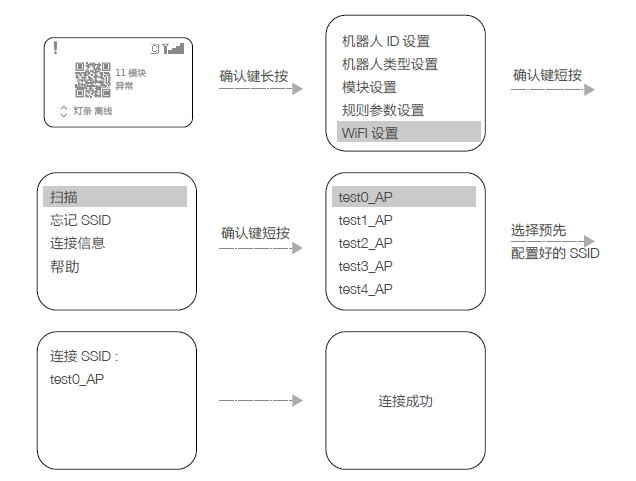
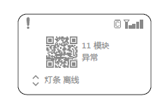
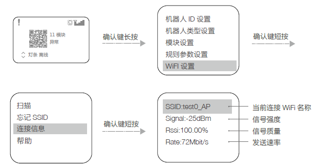

# 2.5 WIFI连接设置方法

- WIFI连接  

通过交互界面，机器人端可以选择预先配置的SSID（即WIFI的名字）与服务器建立连接并通信，具体操作如下：  
  
扫描到SSID后，选中该SSID，长按确定键，可以记忆该SSID。下次开机，机器人端会自动连接该SSID，点击“忘记SSID”会忘记当前记住的SSID。  
连接成功后，在主界面将会显示WIFI信号强度，如下图。  
  

- 查询WIFI信息  

通过交互界面可以查看机器人端当前连接的WIFI信息，操作如下：  

