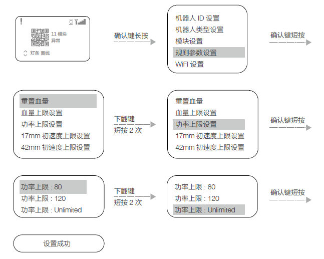

# 2.7 规则参数设置方法

***在离线状态下***，通过交互界面，可以设置机器人的血量上限，弹丸初速度上限、枪口热量上限等参数，举例设置机器人的判定功率为无限大：  
  

根据上述步骤还可以设定以下功能：  

1. 重置血量
2. 设置血量上限
3. 设置限定功率
4. 设置17mm弹丸限定射击初速度
5. 设置42mm弹丸限定射击初速度
6. 设置17mm弹丸限定热量
7. 设置42mm弹丸限定热量
